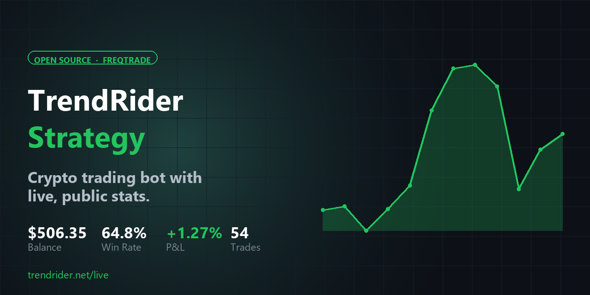

# TrendRider Strategy

[](https://github.com/darkvolg/trendrider-strategy/stargazers)
[](https://opensource.org/licenses/MIT)
[](https://trendrider.net/live)
[](https://www.freqtrade.io/)



> **⭐ If this strategy helps you, please [star the repo](https://github.com/darkvolg/trendrider-strategy)** — it takes one click and keeps me motivated to push updates publicly.

Open-source Freqtrade strategy from the [TrendRider](https://trendrider.net) crypto trading bot.

**See it run live (real money, dry-run mode) →** [trendrider.net/live](https://trendrider.net/live)

The `/live` page exposes the bot's actual SQLite — including losing exit reasons. This repo lets you run the same strategy yourself.

---

## Philosophy

Ride established trends with a **wide stoploss**. Crypto swings 2–4% per hour; tight stops get noise-killed. Default SL is 6% with ATR-aware widening.

Confidence scoring layers six signals (EMA cross, RSI, ADX, volume, BB position, MACD histogram) into a 0–100 score. Entries require ≥ a tunable threshold.

Cascading early loss cut (V4) closes positions that fail to recover within 4h, instead of waiting for the hard SL.

## Backtest highlights (BTC/ETH/SOL · 1h · 30 days)

| Metric | V3 baseline | **V4 (this repo)** |
|---|---|---|
| Total profit | — | **+69% vs V3** |
| Max drawdown | — | **−77% vs V3** |
| Timeframe | 1h | 1h |

V4 was validated against V5 (breakeven exit) and V6 (relaxed 4h cut) — both rejected via backtest. V4 is the local optimum as of 2026-04-14.

For current live performance see [trendrider.net/live](https://trendrider.net/live).

## Install

```bash
# 1. Install Freqtrade (requires Python 3.10+)
pip install freqtrade

# 2. Clone this repo
git clone https://github.com/darkvolg/trendrider-strategy.git
cd trendrider-strategy

# 3. Init Freqtrade user_data
freqtrade create-userdir --userdir user_data

# 4. Drop in the strategy
cp TrendRiderStrategy.py user_data/strategies/

# 5. Use the sample config (dry-run by default)
cp config.example.json user_data/config.json

# 6. Download data + backtest
freqtrade download-data --exchange bybit --pairs BTC/USDT:USDT ETH/USDT:USDT SOL/USDT:USDT --timeframes 1h --days 30
freqtrade backtesting --strategy TrendRiderStrategy --timerange=20260315-20260414
```

## Going live

The shipped config runs in **dry-run mode** (no real orders). To trade for real:

1. Set `"dry_run": false` in `config.example.json`
2. Add Bybit API key/secret (futures, isolated margin)
3. Start with the smallest possible `stake_amount`
4. Run for at least 7 days dry-run first

You can verify the strategy behaves identically to the live bot by comparing your dry-run trades to [trendrider.net/live](https://trendrider.net/live).

## What's not in this repo

The production bot adds a few private layers that aren't open-sourced:

- Fear & Greed Index API integration
- Bybit funding rate / OI signals
- On-chain whale alerts
- Telegram notifications + Cornix routing
- SQLite price-alert layer

All of those are stubbed out here with neutral defaults — the public strategy still trades, just without the external boosts.

## Support the project

This strategy is free and will stay free. If it's useful to you:

- ⭐ **[Star the repo](https://github.com/darkvolg/trendrider-strategy)** — the single biggest signal that this work matters
- 🐛 Open an issue if backtest numbers don't match yours
- 🔀 Fork it, tune it, share what you find

Every star visibly unblocks listings on awesome-lists and helps other traders discover open, honest strategies.

## V4 Pro Pack — $19

The base strategy in this repo is free forever (MIT). If you want the **tuned production hyperopt parameters** (the exact ones running live at [trendrider.net/live](https://trendrider.net/live)) plus a **30-day backtest report** (V3 vs V4 comparison, per-pair breakdown, profit factor 1.03 → 1.41, drawdown −6.12% → −1.42%), a **setup guide**, and the **full V1 → V4 changelog**, there's a Pro Pack for $19.

**[Buy Pro Pack — $19 via @CryptoBot](https://t.me/CryptoBot?start=IVNZsppFp1Kr)** (accepts USDT / TON / USDC)

Full refund within 30 days if the backtest numbers don't reproduce on your setup (±5% tolerance). Leave your Telegram @username or email as the invoice comment — you'll receive the zip within 24 hours.

Full post-mortem of the V3 → V4 fix (13 days breakeven → one fix → +$6.42 in 8 hours): [trendrider.net/blog/freqtrade-bot-14-days-breakeven-v4-fix-2026](https://trendrider.net/blog/freqtrade-bot-14-days-breakeven-v4-fix-2026)

## License

MIT — use it, fork it, paper-trade it. Don't blame me if you lose money.

## Links

- **Live stats:** [trendrider.net/live](https://trendrider.net/live)
- **Blog:** [trendrider.net/blog](https://trendrider.net/blog)
- **Freqtrade docs:** [freqtrade.io](https://www.freqtrade.io)
